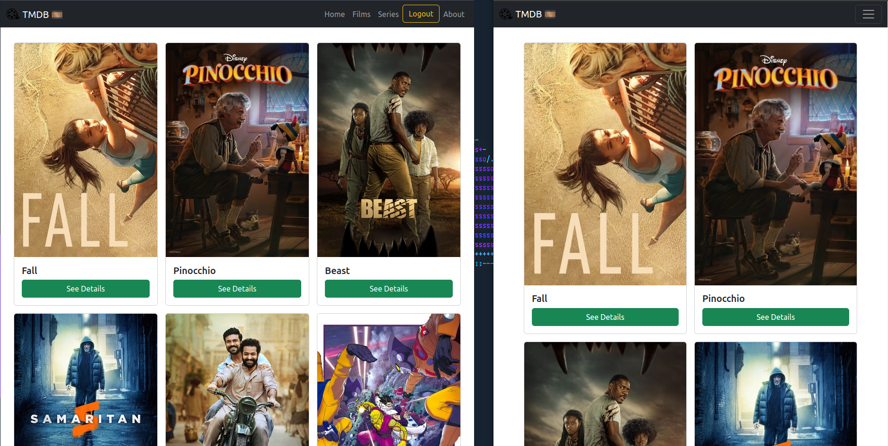

# Simple frontend for the Movie Database API

<br>

## ✨ Features
* [AWS Amplify Autodeploy](https://main.d15pa50iyql6j6.amplifyapp.com/)
* Responsive Bootstrap Cards-like Design
* Built-in authorization and login (request_token obtaining and logon)
* More than 4 URIs to play with (Movies, films, details for both, about, home...)!
* Built with ❤️ with [Angular](https://angular.io/), [Bootstrap](https://getbootstrap.com/) and [The Movie Database API](https://developers.themoviedb.org/)

## 📷 Screenshot



## 🔧 Technical Details / Specs

The login stage is divided into 2.

The first stage, which is a direct prerequisite for the second; and, the second.

First stage is the authorization one; it uses a carefully-crafted Secrets system that provides both in localhost and in Amplify, a private
API Key to start doing the first needed requests.

That API Key shouldn't be leaked so that's why I focused on getting it on a more private, secure way.

It's not immune from proxy-like tools that analyze requests (Such as Burp, for example) but at least, from the build perspective, it doesn't
get leaked.

* The first stage POSTs to ```token/new?api_key=``` followed w/our private API Key; this will return us a ```request_token``` that is needed for the second stage.

* The second stage, POSTs to ```token/validate_with_login?api_key=``` which requires both our private API Key and a JSON body containing the ```username```, the ```password``` (From The Movie Database) and the ```request_token``` we saved previously.

Following after, the logged-in-only parts of the app get shown.

